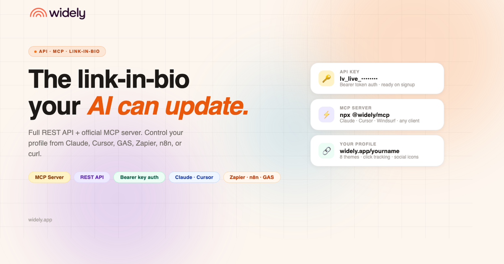

# Widely



**The link-in-bio your AI can update.**

Full REST API + official MCP server. Control your profile from Claude, Cursor, GAS, Zapier, n8n, or curl — no browser required.

→ **Live:** [widely.app](https://widely.app) · staging: [widely.mohamedallam-tu.workers.dev](https://widely.mohamedallam-tu.workers.dev)

---

## What it is

Widely is a Linktree-style link-in-bio platform with one key difference: everything is API-first. The entire profile — links, bio, theme, featured content — is controllable via a REST API with Bearer key auth. Built specifically so tools like Google Apps Script can update your profile programmatically without opening a browser.

**Primary use case:** Cairo Confessions runs its Widely profile entirely via GAS automation. Links get toggled, featured content gets swapped, and the profile stays fresh — all without manual dashboard work.

---

## Stack

| Layer | Tech |
|---|---|
| Framework | TanStack Start (React 19 SSR) |
| Database | Supabase (Postgres + RLS + Auth) |
| Hosting | Cloudflare Workers |
| Styling | Tailwind CSS v4 |
| Build | Vite + `npm run build` |

---

## Getting started

```bash
git clone https://github.com/mohamedallam13/widely
cd widely
npm install
cp .env.example .env   # fill in your Supabase vars
npm run dev
```

**Required env vars** (`.env`):
```
SUPABASE_URL=https://your-project.supabase.co
SUPABASE_PUBLISHABLE_KEY=sb_publishable_...
SUPABASE_SERVICE_ROLE_KEY=sb_secret_...
VITE_SUPABASE_URL=https://your-project.supabase.co
VITE_SUPABASE_PUBLISHABLE_KEY=sb_publishable_...
VITE_SUPABASE_PROJECT_ID=your-project-ref
```

**DB setup** — run once on a fresh Supabase project:
```bash
# paste contents of Docs/schema.sql into Supabase SQL Editor
```

---

## Deploy

```bash
npm run build
npx wrangler deploy
```

Or push to trigger an automatic deploy:
```bash
git push widely main
```

The `wrangler.jsonc` contains non-secret env vars. The service role key is stored as a Cloudflare Worker secret:
```bash
npx wrangler secret put SUPABASE_SERVICE_ROLE_KEY
```

---

## MCP Server

Widely ships an official MCP server — `@widely/mcp`. Add it to Claude, Cursor, Windsurf, or any MCP-compatible client and control your profile in plain conversation.

```json
{
  "mcpServers": {
    "widely": {
      "command": "npx",
      "args": ["-y", "@widely/mcp"],
      "env": {
        "WIDELY_API_KEY": "lv_live_..."
      }
    }
  }
}
```

Then just ask: *"Add a link to my new project"* or *"Switch my theme to noir."*

Source: [`packages/mcp/`](packages/mcp/)

---

## REST API

Base URL: `https://widely.app/api/public/v1`  
Auth: `Authorization: Bearer <your_api_key>`

Generate an API key from your dashboard at `/app/api-keys`.

### Links

```bash
# List all links
GET /links

# Create a link
POST /links
{ "title": "My link", "url": "https://example.com", "featured": false }

# Update a link
PATCH /links/:id
{ "title": "New title", "visible": false, "featured": true }

# Delete a link
DELETE /links/:id

# Reorder links
POST /links/reorder
{ "ids": ["uuid-1", "uuid-2", "uuid-3"] }
```

### Profile

```bash
# Get profile
GET /profile

# Update profile
PATCH /profile
{ "bio": "Updated bio", "theme": "midnight" }
```

Full reference: [`Docs/api-reference.md`](Docs/api-reference.md)

### Google Apps Script example

```javascript
const BASE = "https://widely.app/api/public/v1";
const KEY  = "your_api_key";

function toggleLink(id, visible) {
  UrlFetchApp.fetch(`${BASE}/links/${id}`, {
    method: "PATCH",
    headers: { "Authorization": `Bearer ${KEY}`, "Content-Type": "application/json" },
    payload: JSON.stringify({ visible }),
  });
}
```

---

## Themes

8 handcrafted themes, switchable from the design page or via API:

| Theme | Best for |
|---|---|
| `noir` | Default dark minimal |
| `midnight` | Deep blue — Cairo Confessions branding |
| `neon` | High contrast, bold |
| `bone` | Warm off-white light mode |
| `indigo_mist` | Soft purple gradient |
| `sunset` | Warm orange/red |
| `forest` | Deep green |
| `mono` | Pure black & white |

---

## Project structure

```
src/
├── routes/
│   ├── index.tsx                          # Landing page
│   ├── login.tsx                          # Login (email or @handle)
│   ├── signup.tsx                         # Signup
│   ├── $username.tsx                      # Public profile page
│   ├── r.$id.tsx                          # Click tracking redirect
│   ├── _authenticated.app.links.tsx       # Admin — manage links
│   ├── _authenticated.app.design.tsx      # Admin — theme & cover photo
│   ├── _authenticated.app.api-keys.tsx    # Admin — API key management
│   └── api/public/v1/
│       ├── links.tsx                      # GET / POST links
│       ├── links.$id.tsx                  # PATCH / DELETE link
│       ├── links.reorder.tsx              # POST reorder
│       └── profile.tsx                   # GET / PATCH profile
├── integrations/supabase/
│   ├── client.ts                          # Browser Supabase client
│   ├── client.server.ts                   # Server admin client (service role)
│   └── auth-middleware.ts                 # Auth middleware for protected routes
├── lib/
│   ├── api-key.server.ts                  # Key hashing, auth, CORS
│   └── themes.ts                          # Theme definitions & swatches
└── server.ts                              # Cloudflare Worker entry (env bridge)

Docs/
├── schema.sql                             # Full DB schema — run once on fresh project
├── api-reference.md                       # Full REST API docs
└── gas-snippets.md                        # GAS helper functions & examples
```

---

## Database schema

Three tables, full RLS:

- **`profiles`** — one per user, linked to `auth.users`. Username, bio, avatar, cover, theme, socials.
- **`links`** — belongs to a user. Title, URL, position, visibility, featured flag, click count, optional image.
- **`api_keys`** — hashed API keys with prefix for display. Used for REST API auth.

Storage buckets: `avatars` and `link-images` (both public read, owner write via RLS).

Signup trigger auto-generates a username from the user's email or `username` metadata field.

---

## Docs

- [`Docs/api-reference.md`](Docs/api-reference.md) — full REST API reference
- [`Docs/gas-snippets.md`](Docs/gas-snippets.md) — GAS helper + examples
- [`Docs/schema.sql`](Docs/schema.sql) — complete DB schema

---

## License

Private. All rights reserved.
