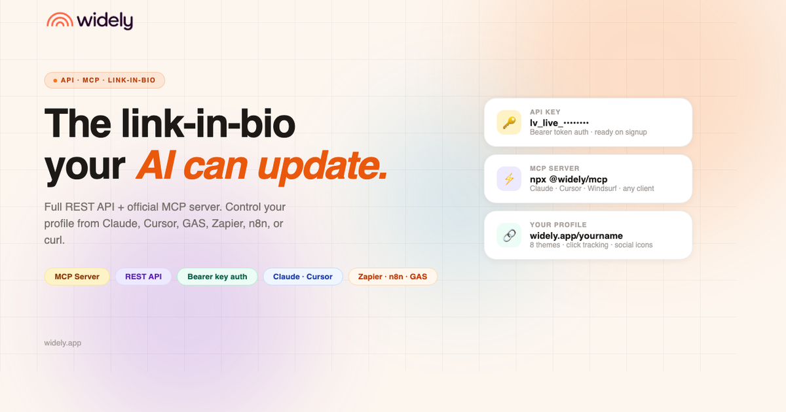
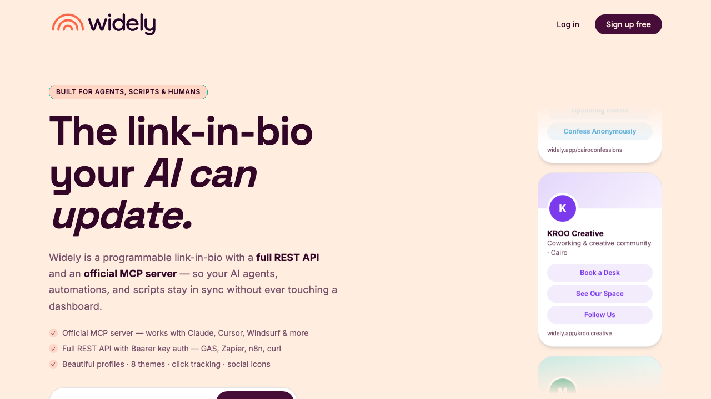
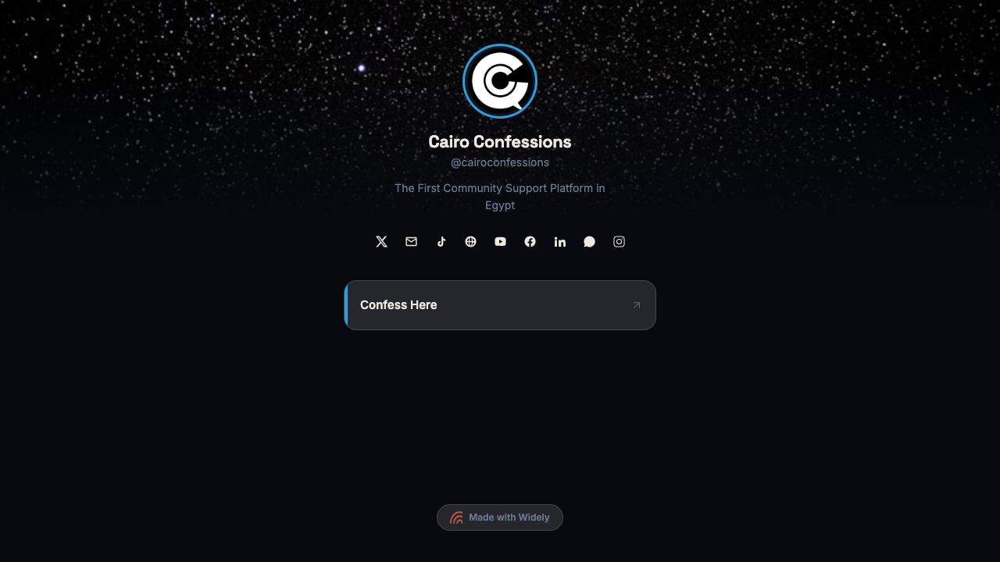

<div align="center">



<h1>Widely</h1>

**The link-in-bio your AI can update.**

[](https://widely.app)
[](https://workers.cloudflare.com)
[](https://supabase.com)
[](https://npmjs.com/package/@widely/mcp)
[](/)

[Live App](https://widely.app) · [API Reference](Docs/api-reference.md) · [GAS Snippets](Docs/gas-snippets.md) · [DB Schema](Docs/schema.sql)

</div>

---

Full REST API + official MCP server. Control your profile from Claude, Cursor, GAS, Zapier, n8n, or curl — no browser required.

---

## Screenshots

<div align="center">

| Landing | Live Profile |
|:-------:|:-----------:|
|  |  |

</div>

---

## What it is

Widely is an API-first link-in-bio platform. The entire profile — links, bio, theme, featured content — is controllable via REST API with Bearer key auth. Built so tools like Google Apps Script can update your profile programmatically without ever opening a browser.

**Primary use case:** Cairo Confessions runs its Widely profile via GAS automation. Links get toggled, featured content gets swapped, the profile stays fresh — all without manual work.

---

## Stack

| Layer | Tech |
|---|---|
| Framework | TanStack Start (React 19 SSR) |
| Database | Supabase (Postgres + RLS + Auth) |
| Hosting | Cloudflare Workers |
| Styling | Tailwind CSS v4 |
| Build | Vite + `npm run build` |

---

## Getting Started

```bash
git clone https://github.com/mohamedallam13/widely
cd widely
npm install
cp .env.example .env
npm run dev
```

**Required env vars** (`.env`):
```
SUPABASE_URL=https://your-project.supabase.co
SUPABASE_PUBLISHABLE_KEY=sb_publishable_...
SUPABASE_SERVICE_ROLE_KEY=sb_secret_...
VITE_SUPABASE_URL=https://your-project.supabase.co
VITE_SUPABASE_PUBLISHABLE_KEY=sb_publishable_...
VITE_SUPABASE_PROJECT_ID=your-project-ref
```

**DB setup** — run once on a fresh Supabase project:
```bash
# paste contents of Docs/schema.sql into Supabase SQL Editor
```

---

## Deploy

> ⚠️ `main` is branch-protected — always open a PR, never push directly.

**Via PR (standard):**
```bash
git checkout -b feat/your-change
git add . && git commit -m "feat: describe change"
git push widely feat/your-change
gh pr create && gh pr merge --squash --delete-branch
```

**Direct deploy (skip GitHub):**
```bash
npm run build && npx wrangler deploy
```

Secrets are stored as Cloudflare Worker secrets:
```bash
npx wrangler secret put SUPABASE_SERVICE_ROLE_KEY
```

---

## MCP Server

Control your profile from any MCP-compatible client — Claude, Cursor, Windsurf, and more.

```json
{
  "mcpServers": {
    "widely": {
      "command": "npx",
      "args": ["-y", "@widely/mcp"],
      "env": { "WIDELY_API_KEY": "lv_live_..." }
    }
  }
}
```

Then just say: *"Add a link to my new project"* or *"Switch my theme to noir."*

Source: [`packages/mcp/`](packages/mcp/)

---

## REST API

**Base URL:** `https://widely.app/api/public/v1`
**Auth:** `Authorization: Bearer <your_api_key>`

```bash
GET    /links              # List all links
POST   /links              # Create a link
PATCH  /links/:id          # Update a link
DELETE /links/:id          # Delete a link
POST   /links/reorder      # Reorder links
GET    /profile            # Get profile
PATCH  /profile            # Update profile
```

**Google Apps Script example:**
```javascript
function toggleLink(id, visible) {
  UrlFetchApp.fetch(`https://widely.app/api/public/v1/links/${id}`, {
    method: "PATCH",
    headers: { "Authorization": `Bearer ${YOUR_KEY}`, "Content-Type": "application/json" },
    payload: JSON.stringify({ visible }),
  });
}
```

Full reference: [`Docs/api-reference.md`](Docs/api-reference.md)

---

## Themes

8 handcrafted themes, switchable from the design page or via API:

| Theme | Style |
|---|---|
| `noir` | Default dark minimal |
| `midnight` | Deep blue |
| `neon` | High contrast, bold |
| `bone` | Warm off-white |
| `indigo_mist` | Soft purple gradient |
| `sunset` | Warm orange/red |
| `forest` | Deep green |
| `mono` | Pure black & white |

---

## Project Structure

```
src/
├── routes/
│   ├── index.tsx                          # Landing page
│   ├── login.tsx / signup.tsx             # Auth
│   ├── $username.tsx                      # Public profile
│   ├── r.$id.tsx                          # Click tracking redirect
│   ├── _authenticated.app.links.tsx       # Admin — links
│   ├── _authenticated.app.design.tsx      # Admin — theme
│   ├── _authenticated.app.api-keys.tsx    # Admin — API keys
│   └── api/public/v1/                     # REST API routes
├── integrations/supabase/                 # Supabase clients + auth middleware
├── lib/
│   ├── api-key.server.ts                  # Key hashing, auth, CORS
│   └── themes.ts                          # Theme definitions
└── server.ts                              # Cloudflare Worker entry

Docs/
├── schema.sql                             # Full DB schema
├── api-reference.md                       # REST API docs
└── gas-snippets.md                        # GAS helpers
```

---

## Database

Three tables, full RLS:

- **`profiles`** — one per user. Username, bio, avatar, cover, theme, socials.
- **`links`** — belongs to a user. Title, URL, position, visibility, featured flag, click count.
- **`api_keys`** — hashed keys with prefix for display.

Signup trigger auto-generates a username from the user's email.

---

<div align="center">

Made with Widely · [widely.app](https://widely.app)

</div>
